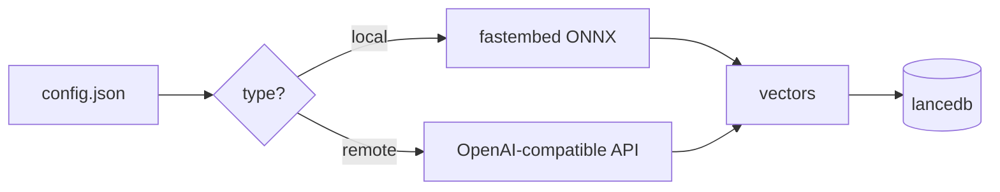

# config

`%AppData%\com.rememex.app\config.json`

the app creates this on first run. you can hand-edit it. if you break the JSON, it'll reset to defaults and migrate what it can. don't worry about it.

## schema validation

want autocomplete and red squiggles in your editor? add this to the top of your config.json:

```json
{
  "$schema": "https://raw.githubusercontent.com/illegal-instruction-co/rememex/main/config.schema.json"
}
```

vscode will pick it up automatically. schema lives at [`config.schema.json`](config.schema.json) in the repo.

## embedding provider

default is local -- models run on your machine, nothing leaves it.



### local (default)

```json
{
  "embedding_provider": {
    "type": "local",
    "model": "MultilingualE5Base"
  }
}
```

models: `AllMiniLML6V2`, `MultilingualE5Small`, `MultilingualE5Base`

change the model and restart. it'll download the new one and rebuild the index. don't mix models with existing indexes -- dimensions won't match and search will silently return garbage.

### remote

```json
{
  "embedding_provider": {
    "type": "remote",
    "endpoint": "https://api.openai.com/v1/embeddings",
    "api_key": "sk-...",
    "model": "text-embedding-3-small",
    "dimensions": 1536
  }
}
```

any OpenAI-compatible embedding API works (OpenAI, Gemini, Cohere, Ollama, local vLLM, whatever). just point `endpoint` at it.

- **endpoint** -- the embeddings API URL
- **api_key** -- optional. sent as `Bearer` token. leave empty for local servers
- **model** -- model name sent in the request body
- **dimensions** -- output vector size. must match the model. wrong value = broken index

the global provider is used as the default for new containers. each container picks its own provider (local or remote) during creation. you can also edit config.json by hand. restart required for global changes.

## hotkey

```json
{
  "hotkey": "Alt+Space"
}
```

default is `Alt+Space`. if that's already mapped to something else on your system, change it here. format: modifiers joined with `+`, then the key.

modifiers: `Alt`, `Ctrl`, `Shift`, `Super` (or `Win`/`Meta`/`Cmd`)

keys: letters (`A`-`Z`), digits (`0`-`9`), `F1`-`F12`, `Space`, `Enter`, `Tab`, `Escape`, arrows (`Up`/`Down`/`Left`/`Right`), and most punctuation.

examples: `Ctrl+Shift+K`, `Alt+F1`, `Super+Space`, `Ctrl+Alt+R`

restart the app after changing.

## always on top

```json
{
  "always_on_top": true
}
```

default is `true`. set to `false` if you want the window to behave like a normal app (goes behind other windows when you click away). restart required.

## launch at startup

```json
{
  "launch_at_startup": false
}
```

default is `false`. set to `true` and the app will start automatically when you log in. uses the system's native startup mechanism (registry on windows, launch agent on mac, autostart on linux). restart required to apply changes.
## indexing

```json
{
  "indexing": {
    "extra_extensions": ["xyz", "custom"],
    "excluded_extensions": ["lock", "map"],
    "chunk_size": 1200,
    "chunk_overlap": 200
  }
}
```

all fields optional. skip what you don't need.

- **extra_extensions** -- got a weird file format? throw its extension here. it'll get indexed with default chunking. no semantic splitting (that's hardcoded per-language), but overlap chunking works fine for any text file
- **excluded_extensions** -- some extension getting indexed that you don't want? kill it here. overrides the built-in list
- **chunk_size** -- max bytes per chunk. default varies by filetype (1200 for code, 800 for docs, 600 for config files). set this to override globally
- **chunk_overlap** -- bytes of overlap between chunks. prevents losing context at boundaries. default is 100-200 depending on filetype

don't go crazy with chunk_size. the embedding model has a token limit (~512 tokens). bigger chunks = more truncation = worse search quality. the defaults are already tuned.

## .rcignore

drop a `.rcignore` file in any indexed folder. same syntax as `.gitignore`. the indexer respects both.

use this for stuff `.gitignore` doesn't cover -- large datasets, personal notes, build artifacts from non-git projects, whatever.

the app ships with a default `.rcignore` that excludes the obvious stuff (node_modules, dist, binaries, videos, archives, db files).

## containers

```json
{
  "containers": {
    "Work": {
      "description": "work stuff",
      "indexed_paths": ["C:\\Projects"]
    },
    "Personal": {
      "description": "",
      "indexed_paths": ["D:\\Notes", "D:\\Photos"]
    }
  },
  "active_container": "Work"
}
```

each container = isolated index. separate lancedb table. delete a container --> its data is gone, no orphaned vectors floating around.

new containers snapshot the current embedding provider at creation time. switching containers auto-loads the correct provider (local or remote), so you can have one container indexed with local E5 and another with OpenAI -- no manual switching needed.

managed through the GUI, but you can edit this by hand if you want.

## reranker

```json
{
  "use_reranker": true
}
```

default is `true`. the cross-encoder reranker improves result quality but uses ~1GB extra RAM. set to `false` to disable. if you're using high-quality remote embeddings (OpenAI, Gemini), disabling the reranker often gives better results anyway.

## supported file types

120+ extensions out of the box. the big ones:

**code** -- rs, py, js, ts, tsx, jsx, go, java, kt, scala, swift, dart, php, c, cpp, cs, rb, lua, zig, nim, ex, erl, hs, ml, elm, sol, and like 50 more

**docs** -- md, txt, rst, adoc, tex, pdf

**config** -- toml, yaml, json, ini, cfg, env, tf, hcl, nix, proto, graphql

**data** -- csv, tsv, sql, log

**web** -- html, css, scss, less, sass, vue, svelte, astro, pug, ejs, hbs

**devops** -- sh, bash, zsh, fish, ps1, bat, cmd, dockerfile, makefile

**images** -- png, jpg, gif, bmp, tiff, webp (via OCR)

don't see your extension? add it to `extra_extensions` in config. or open a PR and we'll add semantic chunking patterns for it too.

## logs

`%AppData%\com.rememex.app\rememex.log`

model loading, indexing errors, watcher events. check here when something feels broken.

## models location

`%AppData%\com.rememex.app\models\`

~2GB total. downloaded automatically on first run via huggingface hub. if your network is flaky, set `HTTPS_PROXY` env var. the models are ONNX format, managed by fastembed.
