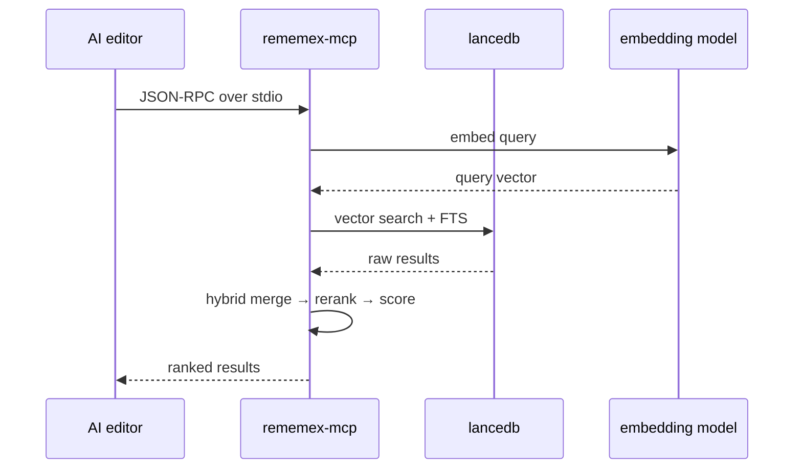

# MCP server

you know how every AI editor wants you to install some extension or connect to some API? forget that. rememex has an MCP server built in. one exe, stdin/stdout, done.

plug it into cursor, claude desktop, copilot, whatever. your AI can now search your local files without you copy-pasting paths like an animal.

## tools

### `rememex_search`

full pipeline. vector search → keyword search → hybrid merge → JINA reranker. same quality as the GUI. returns paths, snippets, scores.

| param | type | default | description |
|-------|------|---------|-------------|
| `query` | string | required | what you're looking for |
| `container` | string? | active | which container to search |
| `top_k` | number? | 10 | results to return (max 50) |
| `file_extensions` | string[]? | all | filter by extension, e.g. `["rs", "ts"]` |
| `path_prefix` | string? | none | filter by path prefix, e.g. `"src/indexer"` |
| `context_bytes` | number? | 1500 | snippet size in bytes (max 10000) |
| `min_score` | number? | 0 | minimum relevance score (0-100), results below this are filtered out |

### `rememex_read_file`

agent finds a file via search → reads it without leaving MCP. no more round-trips.

| param | type | default | description |
|-------|------|---------|-------------|
| `path` | string | required | absolute path to the file |
| `start_line` | number? | 1 | start line (1-indexed, inclusive) |
| `end_line` | number? | EOF | end line (1-indexed, inclusive) |

security: only reads files inside indexed container paths. can't escape to random system files.

### `rememex_list_files`

get the project structure instantly. returns deduplicated file list with sizes.

| param | type | default | description |
|-------|------|---------|-------------|
| `container` | string? | active | which container |
| `path_prefix` | string? | none | filter by path prefix |
| `extensions` | string[]? | all | filter by extension |

### `rememex_index_status`

agent checks if the index is fresh or empty before wasting time searching.

| param | type | default | description |
|-------|------|---------|-------------|
| `container` | string? | active | which container |

returns: `total_files`, `total_chunks`, `has_index`, `indexed_paths`, container metadata.

### `rememex_diff`

what changed recently? call this at the start of every conversation to get instant context.

| param | type | default | description |
|-------|------|---------|-------------|
| `since` | string | required | time window: `"30m"`, `"2h"`, `"1d"`, `"7d"` |
| `container` | string? | active | which container |
| `show_diff` | bool? | true | include file preview (first 50 lines) |

returns: changed file paths, timestamps, previews, and detects deleted files.

### `rememex_related`

given a file, finds other files with similar meaning. uses vector proximity in embedding space -- not grep, not imports, actual semantic similarity.

| param | type | default | description |
|-------|------|---------|-------------|
| `path` | string | required | absolute path to the file |
| `container` | string? | active | which container |
| `top_k` | number? | 10 | related files to return (max 30) |

returns: related file paths with similarity scores and snippets.

### `rememex_list_containers`

dumps your containers. names, paths, descriptions, which one's active. no params.

## get the binary

grab `rememex-mcp.exe` from [releases](https://github.com/illegal-instruction-co/rememex/releases).

or build it yourself if you're into that:
```bash
cargo build --bin rememex-mcp --release
# sits in src-tauri/target/release/
```

## before you start

index some folders in the main app first. the MCP server doesn't index anything, it just searches. no index = no results = you'll think it's broken.

## hook it up

### cursor

settings → MCP → add server. or just edit `~/.cursor/mcp.json`:

```json
{
  "mcpServers": {
    "rememex": {
      "command": "C:\\Users\\YOU\\rememex-mcp.exe"
    }
  }
}
```

restart. done.

### claude desktop

edit `%AppData%\Claude\claude_desktop_config.json`:

```json
{
  "mcpServers": {
    "rememex": {
      "command": "C:\\Users\\YOU\\rememex-mcp.exe"
    }
  }
}
```

restart. done.

### VS code copilot

`.vscode/mcp.json` or user settings:

```json
{
  "mcp": {
    "servers": {
      "rememex": {
        "command": "C:\\Users\\YOU\\rememex-mcp.exe"
      }
    }
  }
}
```

### anything else

stdio transport. point at the exe. no args, no env vars, no ports, no docker. just the path.

## teach your agent how to use it

hooking up the MCP server is step 1. step 2 is making sure the AI agent actually knows *how* to use the tools strategically. that's what [AGENT.md](AGENT.md) is for.

AGENT.md ships alongside `rememex-mcp.exe`. default location:

```
%LocalAppData%\rememex\AGENT.md
```

every editor has its own way to inject project-level instructions. drop one of these in your project so the agent reads AGENT.md automatically:

### cursor

drop a `.cursorrules` file in your project root:

```
Read the file at %LocalAppData%\rememex\AGENT.md for instructions on how to use the rememex MCP tools.
```

or if you use the rules directory, create `.cursor/rules/rememex.mdc`:

```
---
description: rememex MCP tool usage
globs: *
alwaysApply: true
---
Read the file at %LocalAppData%\rememex\AGENT.md for instructions on how to use the rememex MCP tools.
```

### VS code copilot

create `.github/copilot-instructions.md`:

```markdown
Read the file at %LocalAppData%\rememex\AGENT.md for instructions on how to use the rememex MCP tools.
```

copilot auto-reads this file for every conversation in the project.

### antigravity (google)

create `.agent/rules/rememex.md`:

```
Read the file at %LocalAppData%\rememex\AGENT.md for instructions on how to use the rememex MCP tools.
```

antigravity loads all `.agent/rules/*.md` files as workspace rules automatically.

### any editor that supports system prompts

copy the contents of [AGENT.md](AGENT.md) into your editor's system prompt or custom instructions field. the file is self-contained, no dependencies.

> using windsurf, zed, claude code, or something else? if you know how project-level agent instructions work in your editor, open a PR and add it here.

## what happens under the hood

on launch it:
1. opens the same LanceDB the main app uses (`%AppData%\com.rememex.app\lancedb`)
2. loads embedding model + reranker from local cache (`%AppData%\com.rememex.app\models`)
3. reads your config (`%AppData%\com.rememex.app\config.json`)
4. sits on stdin waiting for queries



first launch is slow (~3-5 sec) because it loads ~1.1GB of embedding model weights + ~1GB reranker. after that it's instant.

## stuff that might confuse you

**no results** -- you didn't index anything. open the main app, index a folder, try again

**slow first query** -- model loading. chill. next ones are fast

**server not showing up** -- check the exe path. absolute path. double backslashes on windows. yes it's annoying

**searching wrong stuff** -- defaults to active container. pass `container: "Whatever"` to pick a different one

**access denied on read_file** -- the file isn't inside any indexed container path. index the parent folder first

**rememex_diff returns nothing** -- if the main app was closed while files were edited, mtime in the index is stale. open the app and let the file watcher catch up

**rememex_related says file not found** -- the file hasn't been indexed yet. index first, search second

## privacy

everything local. reads local DB, uses local models, talks over stdio not network. your files stay on your machine. that's the whole point.
