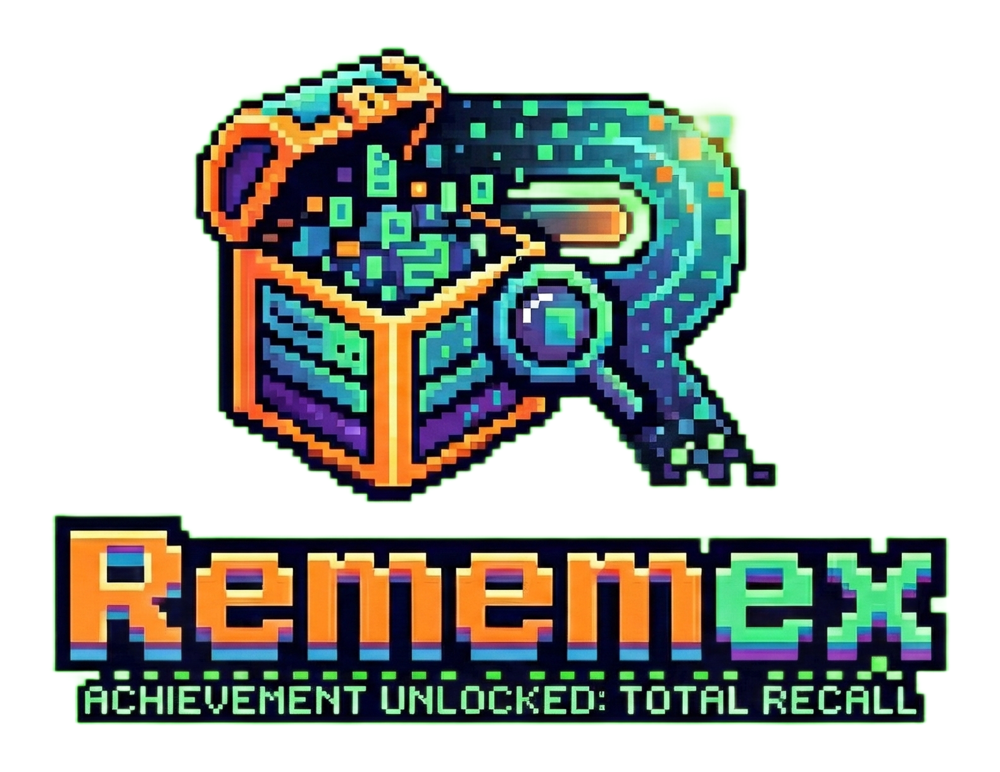
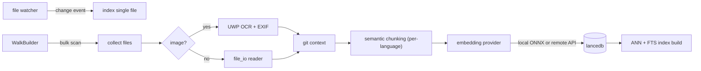
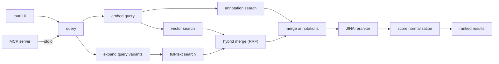

<p align="center">
  
</p>

<h1 align="center">Rememex</h1>

<p align="center">
  <a href="https://github.com/illegal-instruction-co/rememex/releases"></a>
  <a href="LICENSE"></a>
  <a href="https://github.com/illegal-instruction-co/rememex/releases"></a>
  <a href="https://github.com/illegal-instruction-co/rememex/stargazers"></a>
  <a href="https://github.com/illegal-instruction-co/rememex"></a>
</p>

<p align="center">
  a semantic upgrade to your file system. you type meaning, it finds files. nothing leaves your machine.
</p>

<p align="center">
  <em>named after Vannevar Bush's <a href="https://en.wikipedia.org/wiki/Memex">Memex</a> (1945), a vision of a device that stores and retrieves all human knowledge.</em>
</p>

---

**windows 10+ only** for now. uses UWP OCR and mica backdrop. 

<p align="center">
  
</p>

---

## why rememex?

| | rememex | [ripgrep](https://github.com/BurntSushi/ripgrep) | [Everything](https://www.voidtools.com/) | [Sourcegraph](https://sourcegraph.com/) | [Microsoft Recall](https://support.microsoft.com/en-us/windows/retrace-your-steps-with-recall-aa03f8a0-a78b-4b3e-b0a1-2eb8ac48701c) |
|---|---|---|---|---|---|
| **search type** | semantic + keyword hybrid | regex / literal text | filename (content via `content:`) | keyword + symbol + semantic | screenshots your entire life every 5 seconds |
| **understands meaning** | ✅ | ❌ | ❌ | ✅ | ✅ (it saw everything. literally everything.) |
| **local & private** | ✅ everything on your machine | ✅ | ✅ | cloud or self-hosted | "local" (pinky promise) |
| **file types** | 120+ (code, docs, images, configs) | text files | all files (index by name) | code repos | your screen. all of it. always. |
| **image OCR** | ✅ built-in | ❌ | ❌ | ❌ | ✅ (it OCRs your passwords too) |
| **EXIF / GPS** | ✅ reverse geocodes to city names | ❌ | ❌ | ❌ | knows where you are anyway |
| **MCP server** | ✅ built-in for AI agents | ❌ | ❌ | ? | no but copilot watches you type |
| **price** | free, open source | free, open source | free | starts at $49/user/mo | free\* (\*costs your dignity) |
| **vibes** | finds what you mean | finds what you type | finds filenames | enterprise™ | big brother as a feature |

---

## what it does

- indexes 120+ file types (code, docs, images, configs, whatever)
- OCR on images via windows built-in engine
- reads EXIF → reverse geocodes GPS to city names. search "photos from istanbul" and it works
- EXIF dates → human words. "summer morning" finds a photo from july at 8am
- hybrid search: vector + full-text + JINA cross-encoder reranker
- smart chunking per language (rust at `fn`/`struct`, python at `def`/`class`, etc)
- semantic containers for isolation (work/personal/research)
- MCP server for AI agents. [details →](MCP.md) · [agent instructions →](AGENT.md)
- annotations: attach searchable notes to any file, from the UI or via MCP. agents and humans share the same knowledge layer
- optional cloud embeddings -- plug in OpenAI, Gemini, Cohere, or any compatible API. default is still 100% local

---

## architecture

### indexing



### search



---

## run it

```bash
npm install
npm run tauri dev        # dev is slow
npm run tauri build      # release build, use this for real speed
```

`Alt+Space` to toggle. config & docs → [CONFIG.md](CONFIG.md)

RAM usage peaks during initial indexing — this is expected. once indexing completes, it drops and stays stable.

---

## agentic benchmark

same 5 tasks, same codebase. grep vs rememex MCP:

| task | grep | rememex |
|------|------|---------|
| "find where GPS coords become city names" | grep "GPS" → 0. grep "geocode" → found file, need to open. **3 steps** | **1 step** |
| "find the quality filter threshold" | grep "threshold" → 0 (code says `>= 25.0`). **failed** | **1 step** |
| "find dedup logic for best chunk per file" | grep "dedup" → 0. grep "best" → noise. **3-5 steps** | **1 step** |
| "find config migration handling" | grep "legacy" → wrong file. **wrong answer** | **1 step** |
| "find embedding batch size constant" | grep "batch_size" → 0 (it's `EMBED_BATCH_SIZE`). **failed** | **1 step** |

**grep needs the exact keyword. rememex needs the idea.**

agents using rememex are expected to use 5-10x fewer tokens and complete tasks significantly faster. fewer search attempts, fewer wrong files opened, fewer round-trips. the benchmark above shows 1 step vs 3-5 — that's both speed and cost.

<p align="center">
  
</p>

---

## project structure

```
rememex/
├── src/                          # react/ts frontend
│   ├── components/               # UI components
│   │   ├── Sidebar.tsx           # sidebar: containers, annotations, filters
│   │   ├── SearchBar.tsx         # search input
│   │   ├── ResultsList.tsx       # virtualized search results
│   │   ├── StatusBar.tsx         # indexing status bar
│   │   ├── TitleBar.tsx          # custom window title bar
│   │   ├── Settings.tsx          # settings panel
│   │   └── settings/            # modular settings sub-panels
│   ├── locales/                  # i18n translations (en, tr)
│   ├── Modal.tsx                 # modal dialog component
│   ├── i18n.tsx                  # internationalization setup
│   ├── types.ts                  # shared TypeScript types
│   └── App.tsx                   # main app shell
├── src-tauri/
│   └── src/
│       ├── indexer/              # core engine
│       │   ├── mod.rs            # indexer orchestration, batch embed, reranker
│       │   ├── chunking.rs       # per-language semantic splitting
│       │   ├── embedding.rs      # fastembed ONNX inference
│       │   ├── embedding_provider.rs  # local/remote provider trait
│       │   ├── search.rs         # hybrid vector + full-text + reranker
│       │   ├── pipeline.rs       # search pipeline scoring
│       │   ├── annotations.rs    # annotation CRUD operations
│       │   ├── ocr.rs            # UWP OCR bridge
│       │   ├── file_io.rs        # file reading (text, pdf, binary)
│       │   ├── git.rs            # git log integration
│       │   └── db.rs             # lancedb operations
│       ├── bin/mcp.rs            # MCP server binary (stdio)
│       ├── commands.rs           # tauri IPC commands
│       ├── config.rs             # config loading / migration
│       ├── state.rs              # shared app state types
│       ├── watcher.rs            # notify-based file watcher
│       └── lib.rs                # app setup, tray, shortcuts
├── config.schema.json            # JSON schema for config validation
├── AGENT.md                      # agent instructions for MCP
├── MCP.md                        # MCP server documentation
├── CONFIG.md                     # configuration reference
└── ROADMAP.md                    # what's done, what's next
```

---

## stack

rust (tauri 2), react/ts, [lancedb](https://lancedb.com/), Multilingual-E5-Base, JINA Reranker v2, rayon

## roadmap

[ROADMAP.md](ROADMAP.md)

## docs

| doc | what |
|-----|------|
| [CONFIG.md](CONFIG.md) | configuration reference, all options, file types, provider setup |
| [MCP.md](MCP.md) | MCP server setup, tool reference, editor configs |
| [AGENT.md](AGENT.md) | instructions for AI agents using rememex as a tool |
| [CONTRIBUTING.md](CONTRIBUTING.md) | how to contribute, bug reports, PR guidelines |

---

## star history

<a href="https://star-history.com/#illegal-instruction-co/rememex&Date">
 <picture>
   <source media="(prefers-color-scheme: dark)" srcset="https://api.star-history.com/svg?repos=illegal-instruction-co/rememex&type=Date&theme=dark" />
   <source media="(prefers-color-scheme: light)" srcset="https://api.star-history.com/svg?repos=illegal-instruction-co/rememex&type=Date" />
   
 </picture>
</a>

## contributors

<a href="https://github.com/illegal-instruction-co/rememex/graphs/contributors">
  
</a>

## license

MIT
